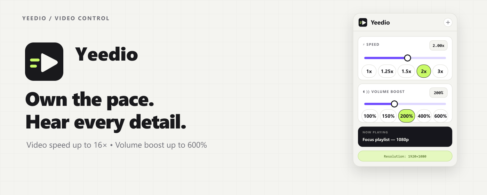

# Yeedio

Yeedio is a Chrome extension for changing HTML5 video speed and boosting volume. It works on sites that use a standard `<video>` element, including videos embedded in iframes.

[Install Yeedio from the Chrome Web Store](https://chromewebstore.google.com/detail/yeedio-video-speed-contro/mghgmbkkajimhejbkkbbodomeelljloc)

## What it does

- Changes playback speed from 0.25x to 16x.
- Boosts volume up to 600% with the Web Audio API.
- Shows the active video's native resolution.
- Remembers the last speed and volume values.
- Provides keyboard shortcuts for speed and volume changes.
- Localizes the popup, settings page, and Chrome commands in 19 languages.

Yeedio cannot run on Chrome's internal pages or the Chrome Web Store. A few sites use custom or protected media players that may not work with Web Audio volume boosting.

## Install from source

1. Download this repository and extract it, or clone it with Git.
2. Open `chrome://extensions` in Chrome.
3. Turn on **Developer mode**.
4. Select **Load unpacked** and choose the repository folder.

If an older unpacked copy is already installed, check its source path on `chrome://extensions`. When it points to this same folder, use **Reload**. When it points somewhere else, remove the old copy before loading this folder to avoid installing Yeedio twice.

Chrome disables file-page access by default. To use Yeedio with local video files, open the extension's details and enable **Allow access to file URLs**.

## Shortcuts

| Action | Default shortcut |
| --- | --- |
| Open Yeedio | `Alt+Shift+Y` |
| Decrease speed | `Alt+Shift+,` |
| Increase speed | `Alt+Shift+.` |

Volume shortcuts are available but unassigned by default. All shortcuts can be changed at `chrome://extensions/shortcuts`.

## Languages

Arabic, Chinese (Simplified), Dutch, English, French, German, Hindi, Indonesian, Italian, Japanese, Korean, Polish, Portuguese (Brazil), Russian, Spanish, Swedish, Thai, Turkish, and Vietnamese.

## Privacy

Yeedio has no analytics, account system, or server. Settings stay in Chrome's local extension storage. The extension requests access to web pages so it can find and control video elements; it does not collect or upload browsing history. See [PRIVACY.md](PRIVACY.md) for the full policy.

## License

[MIT](LICENSE)
